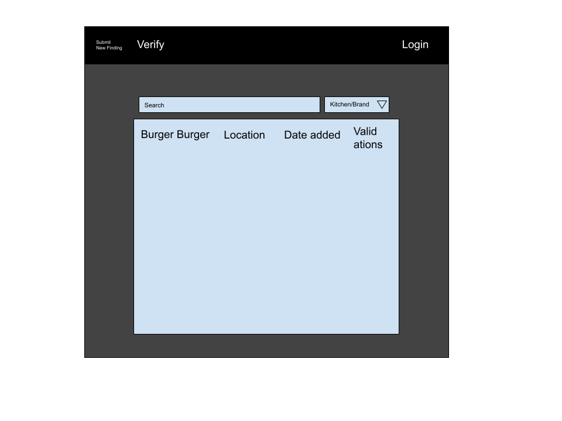

# Ghost Restaurant Records

## Overview

I don't like Ghost restaurants. A ghost restaurant is a restaurant or restaurant chain that doesnt have a physical storefront and is usually sold out of giant cooking complexes which can host up to a dozen of these ghost restaurants. These restuarants try their best to hide that they are infact ghost restaurants and it is very hard to find these industrial kitchen complexes which usually are located in unmarked buildings. These ghost resturants also escape safety and allergen testing by the government and do not follow guidelines. So this is a site which allow users to upload and locate ghost resturant brands and industrial kitchen locations. Users will need to create a profile and log in to suggest location/brands, which will be stored on a mongo database. Users will also be able to rate and verify these brands and locations which other users have recommened. If a user if found to have suggested many incorrect brands/locations, their internal "credit score" will de decreased and the system may not register/show their next suggestions. The site will then allow users to search through these different brands and industrial kitchens to see what is in their local area. (google maps integration?)


## Data Model

The application will store Users, Brands and Kitchens

* users can have multiple listings of Brands/Kitchens (via references)
* Kitchens will have restaurants (via references)


An Example User:

```javascript
{
  username: "Ghost Buster 999",
  hash: // a password hash,
  posts: // an array of Brands/kitechens the user has posted
  cscore: //a number which is determined by the amount of positive/ negative verifications the user has recived
}
```

An Example Kitchen:

```javascript
{
  user: // a reference to a User object
  name: "Bib",
  Brands: //array of brands which oprate at this location,
  createdAt: // timestamp
  tscore://Score which dictates the accuracy and how trusted this posting is
}
```
An Example Brand:
```javascript
{
  user: // a reference to a User object
  name: "Burgerburger",
  Locations: //array of location which host this brand,
  createdAt: // timestamp
  tscore://Score which dictates the accuracy and how trusted this posting is
}
```


## [Link to Commented First Draft Schema](db.mjs) 

## Wireframes

/ - Main page with search



## Site map

Here's a [Site map](documentation/Sitemap.png)

## User Stories or Use Cases

1. as non-registered user, I can register a new account with the site
2. as non-registered user, I can search for Kitchens/Brands and view their posts
3. as a user, I can log in to the site
4. as a user, I can create a post for a Kitchen/Brand that is not on the site already
5. as a user, I can view all of the posts I've created
6. as a user, I can add verify other people's posts anonymously

## Research Topics

* (5 points) Google maps integration
    I want to do multiple integrations with google maps, not only as embeds but also use it to get address information and auto filling posts with addresses. Also to provide images of the location and see maps popup on hover over the location.
* (5 points) Authentication using Passport


10 points total out of 8 required points


## [Link to Initial Main Project File](app.mjs) 

## Annotations / References Used
https://getbootstrap.com/docs/5.0/examples/sidebars/
https://getbootstrap.com/docs/5.0/forms/validation/
